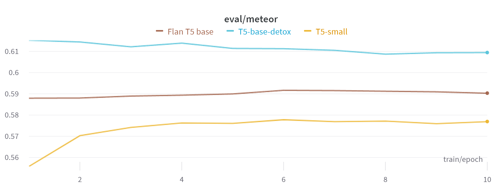
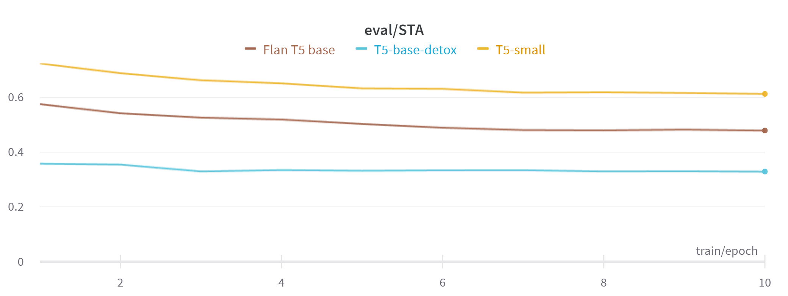
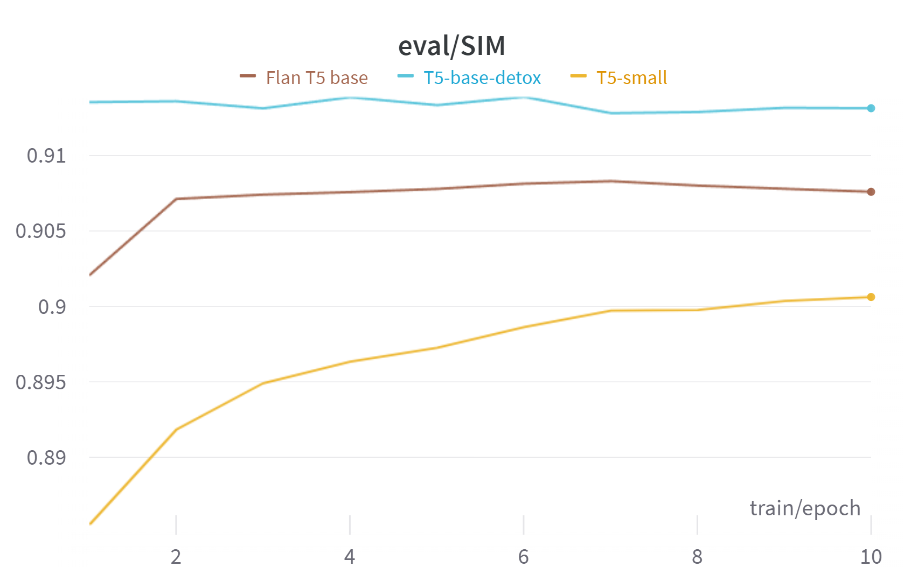
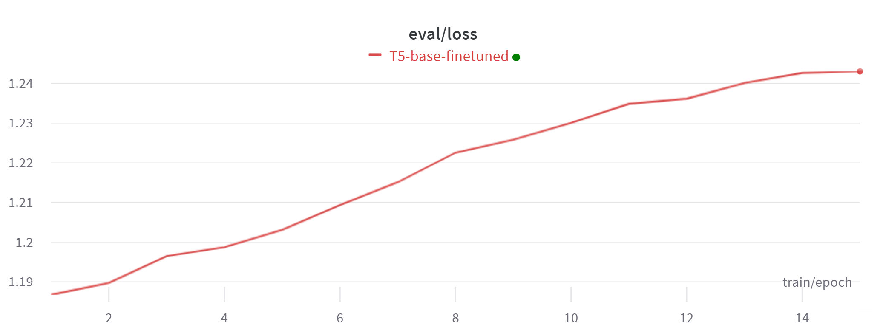
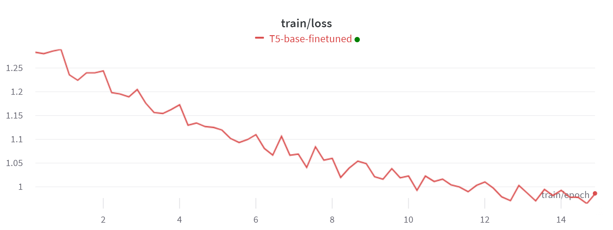
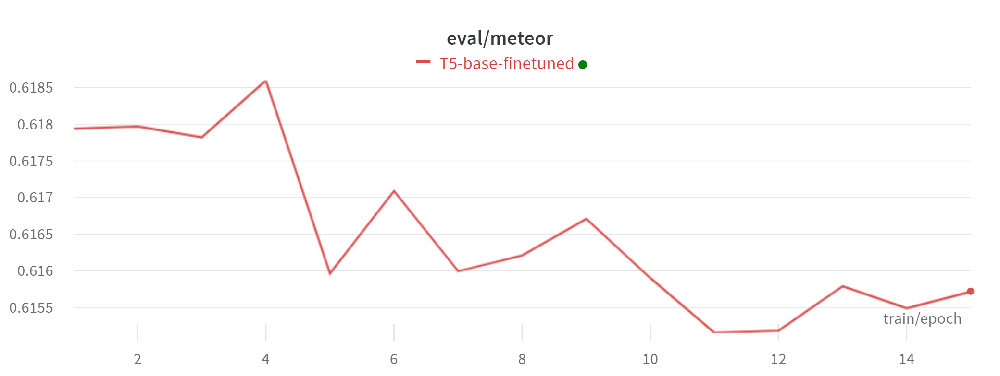
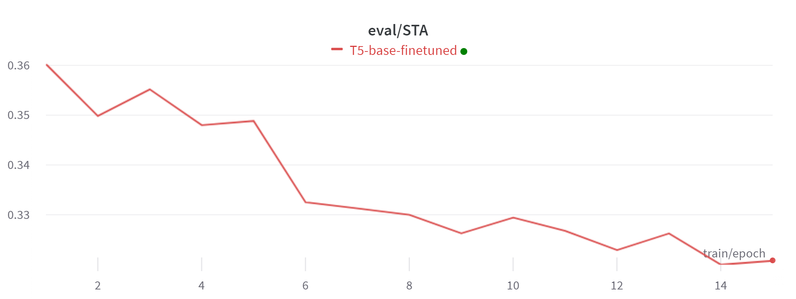
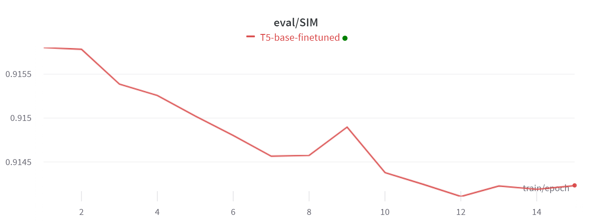
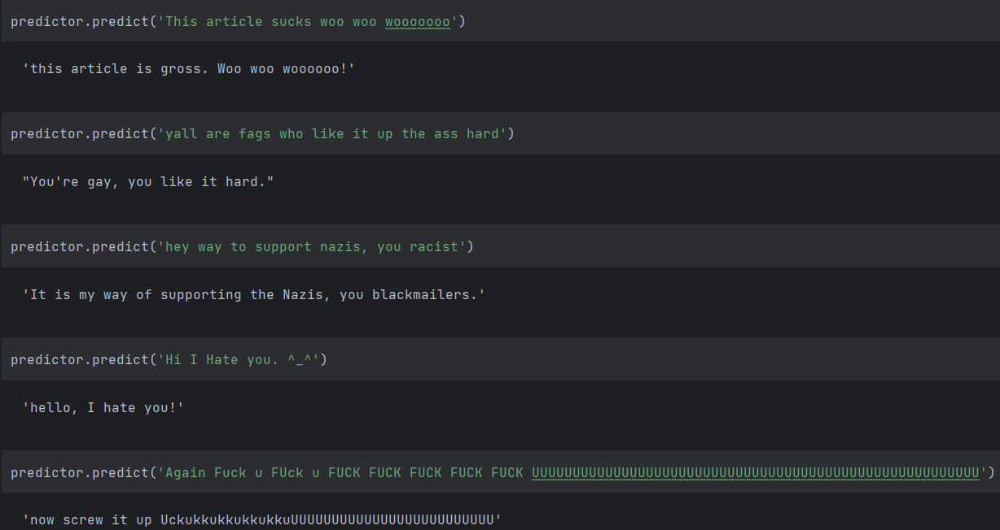

# Final Solution Report

## Introduction

The goal of this project was to develop a text detoxification model that can reduce toxicity in text while preserving meaning. Several models and metrics were explored to identify the best approach.

## Data Analysis

## Model Specification

Four models were evaluated: T5-small, T5-base-detox, Bart-base-detox, and Flan-T5-base. The T5-base-detox model from HuggingFace was selected as it achieved the best performance on validation metrics.

Metrics:

Loss on validation set

Meteor score

Toxicity score

Similarity score

## Training Process

Training is performed on 20000 sample from the dataset on 15 epochs with starting learning_rate = 2e-5.

Training results:

Loss on validation set

Loss on train set

Meteor score

Toxicity score

Similarity score

We can see slight overfitting because the validation loss increases while the training loss decreases. Also the meteor and the similarity become lower.

## Evaluation

Several metrics were used for evaluation:

* Toxicity score (STA): Provided by a RoBERTa toxicity classifier trained on the three datasets by Jigsaw ([Jigsaw 2018](https://www.kaggle.com/c/jigsaw-toxic-comment-classification-challenge), [Jigsaw 2019](https://www.kaggle.com/c/jigsaw-unintended-bias-in-toxicity-classification), [Jigsaw 2020](https://www.kaggle.com/c/jigsaw-multilingual-toxic-comment-classification))
* METEOR: For assessing meaning preservation
* Similarity score (SIM): Using FastText embeddings to compare input and output similarity

I think STA is a key metric because it shows the average toxicity of a sentence. And my model in the detoxified version shows about 0.32.

## Results

You can see the detoxification results by finetuned T5-base-detox model:

- Toxicity score 0.32 on average
- METEOR score of 0.61 indicating good meaning retention
- Similarity score of 0.91 showing high semantic similarity

In conclusion, the T5-base-detox model was successful in reducing toxicity while maintaining meaning as measured by both automatic metrics and human evaluation.