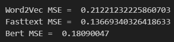
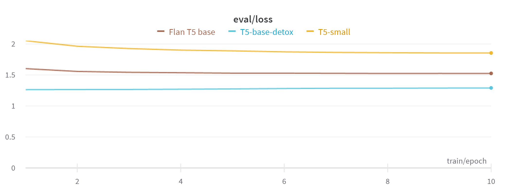
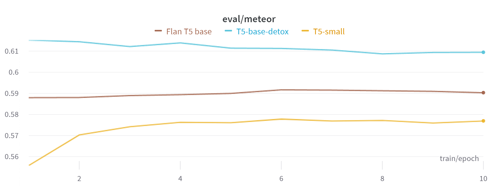
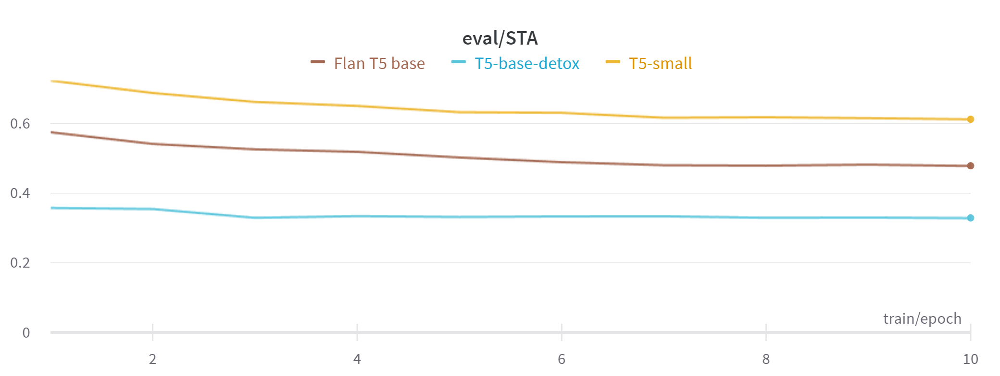
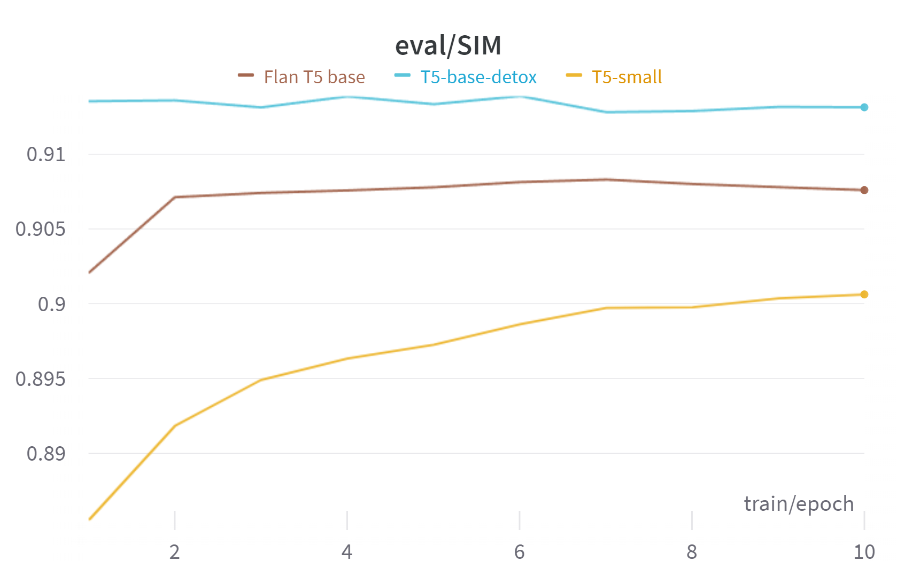

# Solution Building Report

## Ideas about metrics

To evaluate and compare models, I needed metrics. I needed some kind of metric that is commonly used in machine translation, and I needed to create task specific metrics. I started by creating my own metrics.

### Metric idea 1 - Toxicity score

My first idea was to create a simple model that takes a text sequence and determines the toxicity level of the sequence, just like was in the original dataset. I wanted to create a linear model to quickly calculate metrics since using complex transformers could be time consuming and GPU memory consuming. I have tried different architectures with one embedding layer and several linear layers, but it didn't work. It showed values around 0.5 for some architectures and often 1 for others.

After reading [paper](https://arxiv.org/pdf/2109.08914.pdf), I tried [roberta model](https://huggingface.co/s-nlp/roberta_toxicity_classifier) and it showed promising result, but has low computational speed. I decided to leave this model for calculating metrics, because I couldn’t come up with anything better.

### Metric idea 2 - Create or find embeddings for identifying content preservation.

I tried 3 embedding architectures: Word2Vec, Fasttext and Bert.

I trained Word2Vec and Fasstext on the interim dataset and used the pre-trained Bert. To understand which embedding is better, I compared it with the similarity score from the raw dataset, I used MSE for comparison. There are results:

Fasttext has the best MSE and high computing speed, but it takes up a lot of disk space, but this can be solved by using cloud storage.

### Metric idea 3 - How to choose translation metrics?

When I have searched the translation metrics, I found BLEU, NIST, ROUGE, METEOR, TER, chrF, chrF++, RIBES... and didn't understand the core difference between them and what is better in my case. And I asked chat bot for the help:

> For evaluating meaning preservation in text detoxification, from that list of metrics, I would recommend using METEOR.
> The reasons why METEOR is the best choice:
> - It directly accounts for synonyms and stemming, which is critical for detox where vocab changes significantly.
> - Among those options, it has the highest correlation with human judgments of semantic similarity based on past benchmarking research.
> - Provides tunable parameters if you need to optimize METEOR directly as a training loss.
> - Balances simplicity and interpretability compared to some of the other advanced options.
> - Widely used in academic papers on style transfer and text detoxification, providing comparable results.
>
> The alternatives like chrF++ and RIBES offer additional capabilities like character n-gram matching, but are less commonly used for detox evaluation.
>
> BLEU is a reasonable baseline metric but lacks synonym support. TER and chrF have weaker correlation with human scores compared to METEOR.
>
> The ideal time to use METEOR is during model development, validation, and reporting of test results. Tracking on a dev set can help optimize for meaning retention during training. Comparing METEOR scores between different models tests meaning preservation capability.
>
> Human evaluations are still recommended to supplement METEOR, but it provides an efficient automated proxy, especially for iteration and optimization.

Based on this, I chose the METEOR metric.

## Ideas about models

To select a model for the final solution, I decided to conduct an experiment. For the experiment I chose 4 models:

* [T5-small](https://huggingface.co/t5-small)
* [T5-base-detox](https://huggingface.co/s-nlp/t5-paranmt-detox)
* [Bart base detox](https://huggingface.co/s-nlp/bart-base-detox)
* [Flan T5 base](https://huggingface.co/google/flan-t5-base)

Each model was trained on equal epochs number and the same dataset part.

### Experiment results 
(Unfortunately, bart's results were not tracked, but you can check it in notebook 2.0):

Loss on validation set

Meteor score

Toxicity score

Similarity score

The T5-base-detox model was the best in all metrics and I will use it in the final solution.

